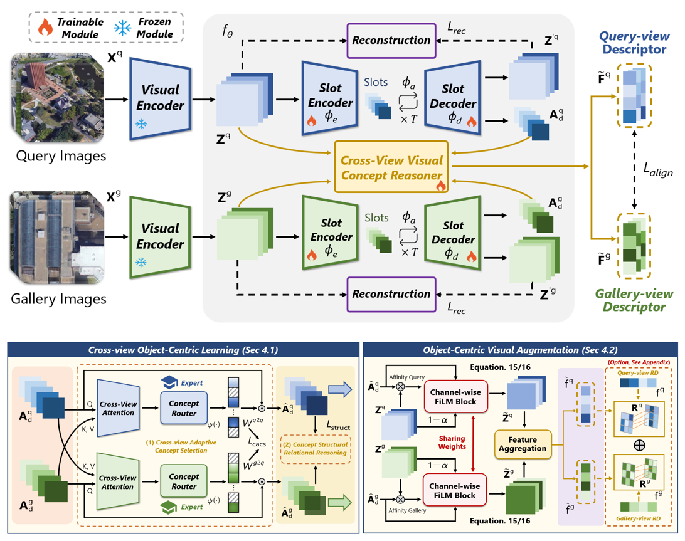

  <h3 align="center">InfoGeo: Information-Theoretic Object-Centric Learning for Cross-View Generalizable UAV Geo-Localization</h3>

<h5 align="center">
  If you like our project, please give us a star ⭐️ for the continuous updates.
</h5>

  By <a href="https://hrt00.github.io/hyzhang.github.io/" target="_blank">Hongyang Zhang1,*</a>,&nbsp;
  Maonan Wang2,3,*,&nbsp;
  Ziyao Wang1,&nbsp;
  Hongrui Yin1,&nbsp;
  Man On Pun1,†

  1CUHK(SZ); 
  2CUHK; 
  3Shanghai AI Lab

  *Equal contribution. †Corresponding author.

##  🔥 News
- [May 01, 2026]: InfoGeo is accepted by ICML'26 🎉

## 📝 Overview

  
   
  <em>Overview Pipeline of InfoGeo & Details on  Cross-view Visual Concept Reasoner </em>

Cross-view geo-localization (CVGL) is fundamental for precise localization and navigation in GPS-denied environments, aiming to match ground or UAV imagery with satellite views. Existing approaches often rely on global feature alignment, but they suffer from substantial domain shifts induced by varying regional textures and weather conditions. This issue becomes even more pronounced in UAV-based scenarios, where the broader perspective inevitably introduces dense, fine-grained objects, creating significant visual clutter. To address this, we draw inspiration from Object-Centric Learning (OCL) and propose InfoGeo, an information-theoretic framework designed to enhance robustness and generalization. InfoGeo reformulates the optimization as an information bottleneck process with two core objectives: (i) maximizing view-invariant information by aligning the object-centric structural relations across views, and (ii) minimizing view-specific noisy signals through cross-view knowledge constraints. Extensive evaluations across diverse benchmarks and challenging scenarios demonstrate that InfoGeo significantly outperforms state-of-the-art methods.

---
