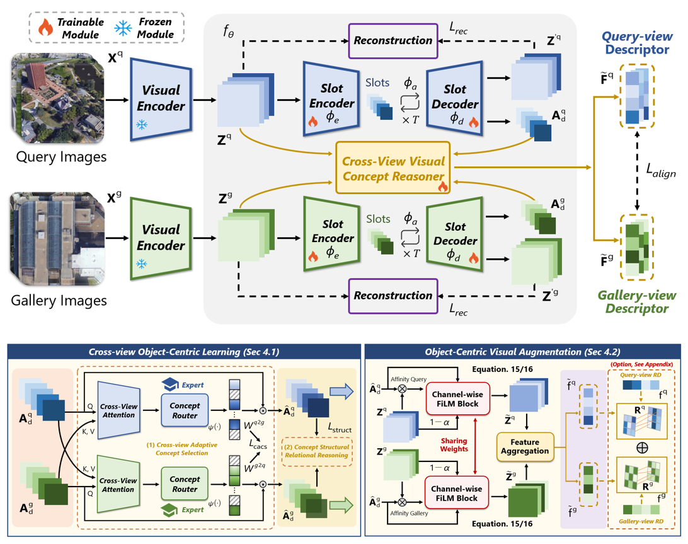

<p align="center">

  <h3 align="center">InfoGeo: Information-Theoretic Object-Centric Learning for Cross-View Generalizable UAV Geo-Localization</h3>

</p>

<h5 align="center">
  If you find this project useful, please consider giving it a star ⭐️.
</h5>

<p align="center">
  By <a href="https://hrt00.github.io/hyzhang.github.io/" target="_blank">Hongyang Zhang<sup>1,*</sup></a>,&nbsp;
  Maonan Wang<sup>2,3,*</sup>,&nbsp;
  Ziyao Wang<sup>1</sup>,&nbsp;
  Hongrui Yin<sup>1,2</sup>,&nbsp;
  Man On Pun<sup>1,†</sup>
</p>

<p align="center">
  <sup>1</sup>CUHK-Shenzhen; 
  <sup>2</sup>CUHK; 
  <sup>3</sup>Shanghai AI Lab
</p>

<p align="center">
  <sup>*</sup>Equal contribution. <sup>†</sup>Corresponding author.
</p>

## <a id="news"></a> 🔥 News

- 🚀 **July 30, 2026:** The InfoGeo model and evaluation code are now open source.
- 🚩 **June 13, 2026:** The InfoGeo model checkpoints have been released.
- 😃 **May 26, 2026:** InfoGeo was featured on [WeChat](https://mp.weixin.qq.com/s/S_7yeJJbXJIqsDUSS8Mf-w) (公众号：**Visual-Language Navigation / 视觉语言导航**).
- 🚩 **May 08, 2026:** Our [preprint](https://arxiv.org/pdf/2605.07099) is now available.
- 🎉 **May 01, 2026:** InfoGeo has been accepted to ICML'26. See you in Seoul, South Korea!

## 📝 Overview

<div align="center">
  
  <br>
  <em>Overview of the InfoGeo framework.</em>
</div>

Cross-view geo-localization (CVGL) matches ground or UAV imagery with satellite views to support localization and navigation in GPS-denied environments. Changes in regional appearance and weather create domain shifts that challenge global feature alignment. UAV imagery adds another difficulty: its broad field of view captures dense, fine-grained objects that introduce visual clutter.

**InfoGeo** draws on Object-Centric Learning (OCL) to improve robustness and generalization. It formulates learning as an information bottleneck with two objectives:

- **Preserve view-invariant information** by aligning object-centric structural relations across views.
- **Suppress view-specific noise** through cross-view knowledge constraints.

## 🚀 How to Use

### (1) Environment

To set up the environment, run:

```bash
# python 3.10
conda create -n cvgl python=3.10 -y
conda activate cvgl
python -m pip install --upgrade pip
pip install -r requirements.txt
```

Run the following commands from the repository directory containing `requirements.txt`, the training scripts, and `eval_cvgl_slot.py`.

### (2) Dataset

**Image datasets.** Follow the preparation instructions provided by each dataset:

| Dataset | Resource |
| --- | --- |
| University-1652 | [Dataset and baseline](https://github.com/layumi/University1652-Baseline) |
| SUES-200 | [Dataset and benchmark](https://github.com/Reza-Zhu/SUES-200-Benchmark) |
| DenseUAV | [Dataset repository](https://github.com/Dmmm1997/DenseUAV) |
| GTA-UAV (GTA-V) | [Dataset repository](https://github.com/Yux1angJi/GTA-UAV) |

**Weather variations.** Use [WeatherPrompt](https://github.com/Jahawn-Wen/WeatherPrompt) and its [weather generation script](https://github.com/Jahawn-Wen/WeatherPrompt/blob/main/weather.py) to generate query images under different weather conditions.

### (3) Model Checkpoints

| Component | Download |
| --- | --- |
| DINOv2-base backbone | [DINOv2 repository](https://github.com/facebookresearch/dinov2) |
| InfoGeo model checkpoints | [Google Drive](https://drive.google.com/drive/folders/14cTbTPOniN_VlJrifTMdjWJ3foGgqIuq) |

Download the backbone weights and the InfoGeo checkpoint for your experiment, then configure their local paths in the model-loading code and evaluation script, respectively.

### (4) Training

We provide two training scripts for InfoGeo:

| Script | Training dataset | Default evaluation setting |
| --- | --- | --- |
| `train_gta_slot.py` | GTA-UAV | GTA-UAV cross-area, drone-to-satellite |
| `train_dense_slot.py` | DenseUAV | SUES-200 at 150 m, drone-to-satellite |

**Configure the data.** Update the paths in the selected script before training:

- **GTA-UAV:** Set `data_root` to the dataset root and check `train_pairs_meta_file`, `test_pairs_meta_file`, and `sate_img_dir`. The default metadata files are `cross-area-drone2sate-train.json` and `cross-area-drone2sate-test.json`.
- **DenseUAV:** Set `data_folder` to the DenseUAV root, with training images under `train/drone/` and `train/satellite/`. Set `query_folder_test` and `gallery_folder_test` to the target evaluation directories; the default configuration uses SUES-200 at 150 m.

**Configure the run.** Set `CUDA_VISIBLE_DEVICES` at the top of the script to select your GPUs. Adjust `batch_size`, `epochs`, `lr`, and `num_workers` in the `Configuration` class, and set `model_path` to your output directory. Keep `checkpoint_start = None` to start a new run with the pretrained backbone, or provide a model checkpoint to initialize from saved weights.

Launch the script for your training dataset:

```bash
# Train on GTA-UAV
python train_gta_slot.py

# Train on DenseUAV
python train_dense_slot.py
```

Each run saves its configuration script, training log, evaluation-selected checkpoints, and final weights (`weights_end.pth`) under `model_path/<model>/<timestamp>/`. Use the saved model weights with the evaluation script below to evaluate on another dataset.

### (5) Cross-Dataset Evaluation

Use the provided [inference script](https://github.com/HRT00/Official_InfoGeo/blob/main/eval_cvgl_slot.py) to evaluate a pretrained model on the target dataset. Before running it, update the following settings in `eval_cvgl_slot.py`:

| Setting | Description |
| --- | --- |
| `data_folder` | Root directory of the target dataset |
| `query_folder_test` | Directory containing the query images |
| `gallery_folder_test` | Directory containing the gallery images |
| `checkpoint_start` | Path to the downloaded InfoGeo checkpoint |
| `batch_size` | Evaluation batch size |

Check the query and gallery assignments in the dataset configuration block, as these paths may be set independently of `data_folder`. Then run:

```bash
python eval_cvgl_slot.py
```

## 🙏 Acknowledgements

We thank the open-source community and the researchers working on Object-Centric Learning and Cross-View Geo-Localization. Our implementation builds on [DIAS](https://github.com/Genera1Z/DIAS) and [CVCities](https://github.com/GaoShuang98/CVCities).

## Cite

If you use InfoGeo in your research, please consider citing our work:

```bibtex
@article{zhang2026infogeo,
  title        = {InfoGeo: Information-Theoretic Object-Centric Learning for Cross-View Generalizable UAV Geo-Localization},
  author       = {Zhang, Hongyang and Wang, Maonnan and Wang, Ziyao and Yin, Hongrui and Pun, Man On},
  year         = {2026},
  eprint       = {2605.07099},
  archivePrefix = {arXiv},
  primaryClass = {cs.CV},
  doi          = {10.48550/arXiv.2605.07099},
  url          = {https://arxiv.org/abs/2605.07099}
}
```

## Contact

For questions about this project, please contact [hongyangzhang1@link.cuhk.edu.cn](mailto:hongyangzhang1@link.cuhk.edu.cn).
